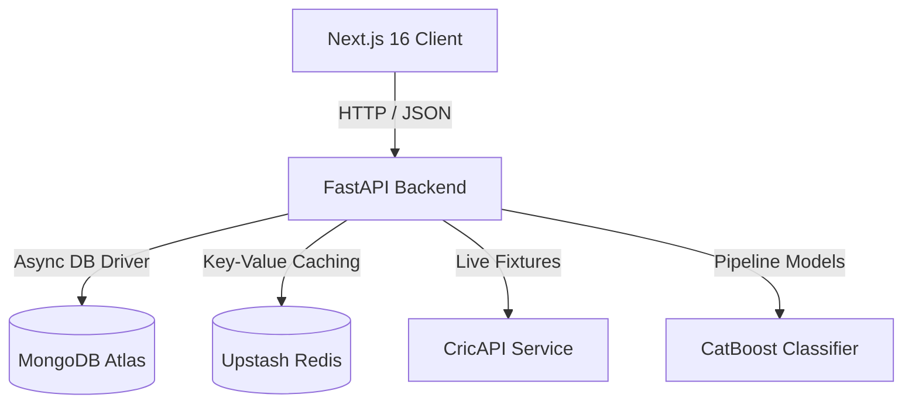

# Winlytics ⚡ — AI Cricket Prediction Platform

Winlytics is an AI-powered cricket match prediction platform. Using historical team data, ELO ratings, recent form, head-to-head records, and venue metrics, Winlytics leverages a CatBoost-powered machine learning pipeline to forecast the winning probability of cricket fixtures (T20, ODI, and Test matches) with high precision.

---

## 🏗️ Core Architecture

Winlytics is built using a modern decoupled client-server architecture:



### 1. Frontend
- **Framework:** Next.js 16 (App Router)
- **Styling:** Tailwind CSS, shadcn/ui components, Framer Motion
- **State Management:** TanStack React Query v5 (client caching and data synchronization)

### 2. Backend
- **Framework:** FastAPI (Python 3.12)
- **Database:** MongoDB (using `motor` for asynchronous driver)
- **Caching:** Redis (lazy connection, deterministic MD5 payload keys, fallback safety)
- **ML Inference:** CatBoost Classifier with Pandas feature engineering

---

## 🚀 Setup & Installation

### Backend Setup
1. Navigate to the backend directory:
   ```bash
   cd backend
   ```
2. Initialize virtual environment:
   ```bash
   python -m venv venv
   source venv/bin/activate  # On Windows: .\venv\Scripts\activate
   ```
3. Install pinned production dependencies:
   ```bash
   pip install -r requirements.txt
   ```
4. Copy the environment template and fill in your keys:
   ```bash
   cp app/.env.example app/.env
   ```
5. Run the server locally:
   ```bash
   uvicorn app.main:app --reload --port 8000
   ```

### Frontend Setup
1. Navigate to the frontend directory:
   ```bash
   cd frontend
   ```
2. Install npm packages:
   ```bash
   npm install
   ```
3. Copy environment template:
   ```bash
   cp .env.production.example .env.local
   ```
4. Run the development server:
   ```bash
   npm run dev
   ```

---

## 🔑 Environment Variables

### Backend (`backend/app/.env`)
- `MONGO_URI`: MongoDB connection string.
- `REDIS_URL`: Redis connection URL for prediction cache.
- `CRICAPI_KEY`: API token for live schedule fetches.
- `JWT_SECRET`: Signing key for JWT user tokens.
- `ALLOWED_ORIGINS`: Comma-separated list of allowed CORS domains.

### Frontend (`frontend/.env.local`)
- `NEXT_PUBLIC_API_URL`: Absolute URL of the FastAPI backend.

---

## 📡 API Overview

### Meta / Health
- `GET /` - Root API description.
- `GET /health` - Application status, database connectivity, and loaded ML model version details.

### Authentication
- `POST /auth/register` - Register a new account (validates email & minimum 8-character passwords).
- `POST /auth/login` - Authenticate and return JWT token.
- `GET /auth/me` - Retrieve user profile.

### Predictions & Analytics
- `POST /predict` - Fetch win probability (caches result in Redis).
- `GET /analytics/{team}` - Performance metrics and simulated trajectory trends.
- `GET /teams` - Valid list of team names.
- `GET /schedule` - CricAPI upcoming fixtures list (cached using a TTLCache).

---

## 🛡️ Production & Deployment Security

1. **Secrets Security:** Real secrets are fully excluded from source code and ignored via Git rules (`.env`, `.env.*` patterns).
2. **CORS Configuration:** Replaced open wildcard defaults with custom environment-driven parsing of `ALLOWED_ORIGINS` fallbacks.
3. **Robust Caching:** Designed memory-saving Redis cache wrapper that intercepts connection failures gracefully without crashing match predictions.
4. **Auth Guards:** Gated sensitive administration paths like `POST /models/activate/{version}` using JWT validation to protect inference versions from unauthorized changes.
